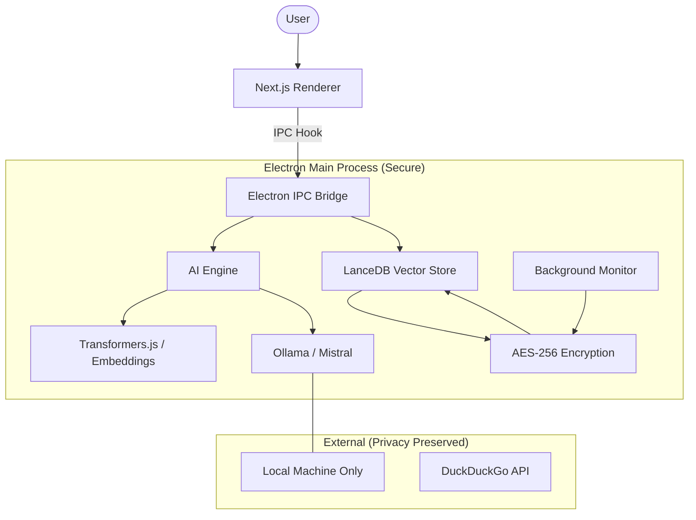

# EchoSphere Project Status Report

This document provides a comprehensive overview of the current implementation status, technical architecture, and the future roadmap for **EchoSphere** — your privacy-first, local AI memory assistant.

---

## 🛠️ Full Tech Stack Details

### **Core Platform**
- **Desktop Framework**: [Electron](https://www.electronjs.org/) (Custom frameless & draggable shell)
- **Frontend Framework**: [Next.js 15](https://nextjs.org/) with [React 19](https://react.dev/) (App Router)
- **Language**: [TypeScript](https://www.typescriptlang.org/) / JavaScript

### **Local AI Stack**
- **Inference Engine**: [Ollama](https://ollama.com/) (Running locally for private LLM execution)
- **Default LLM**: `mistral` (7B parameter model)
- **Embeddings**: [Transformers.js](https://xenova.github.io/transformers.js/) (Model: `Xenova/all-MiniLM-L6-v2` — 384 dimensions)
- **RAG Pipeline**: Custom Retrieval-Augmented Generation logic combining local memory + LLM reasoning.

### **Data & Persistence**
- **Vector Store**: [LanceDB](https://lancedb.github.io/lancedb/) (Native file-based vector database for high-performance search)
- **Relational Data**: [better-sqlite3](https://github.com/WiseLibs/better-sqlite3) (Used for system metadata and local indexing)
- **Format**: [Apache Arrow](https://arrow.apache.org/) (Used for high-speed interoperability between JS and LanceDB)

### **UI & Styling**
- **Styling**: [Tailwind CSS 4](https://tailwindcss.com/)
- **Components**: [Radix UI](https://www.radix-ui.com/) (Primitives) & [Lucide React](https://lucide.dev/) (Icons)
- **Animations**: [Framer Motion](https://www.framer.com/motion/) (Smooth transitions and floating interactions)
- **State Management**: React Hooks & Context API

### **Security & Utilities**
- **Encryption**: [crypto-js](https://github.com/brix/crypto-js) (AES-256 for local memory storage)
- **Background Watcher**: [Chokidar](https://github.com/paulmillr/chokidar) (For upcoming file-system indexing)

---

## ✅ Implemented Features

### **1. Desktop Architecture**
- [x] **Frameless UI**: Truly native feel with custom draggable title bars and window controls.
- [x] **Secure IPC Bridge**: Isolated `contextBridge` for safe communication between the Electron main process and the web frontend.
- [x] **Production Ready**: Configured with `electron-builder` for multi-platform distribution.

### **2. Intelligence Layer (RAG)**
- [x] **Local Embeddings**: Automatic vector generation for every piece of data captured, 100% offline.
- [x] **Semantic Search**: Ability to query past memories based on meaning, not just exact keywords.
- [x] **Context Injection**: The AI reads relevant memories before responding to provide personalized answers.

### **3. Privacy & Security**
- [x] **100% Offline**: No data ever leaves the machine.
- [x] **Encryption at Rest**: Memories are encrypted with AES-256 before being written to the vector store.
- [x] **Local Key Management**: Automatic generation and storage of device-specific encryption keys.

### **4. Memory Capture**
- [x] **Clipboard Monitor**: Background service that auto-detects and indexes copied text (with encryption and embedding).
- [x] **Web Search Integration**: Integrated DuckDuckGo "Instant Answers" API via the main process to supplement local memory.

---

## 🚀 To Be Implemented (Roadmap)

### **Phase 1: Polish & Integration (Immediate)**
- [ ] **Ollama Health Monitor**: In-app UI indicator showing the status of the local LLM and required models.
- [ ] **Memory Management UI**: A dedicated interface to view, edit, or delete specific memories.
- [ ] **Improved Capture Sources**: Browser history indexing and a "Watcher" for local document folders (PDF/TXT).

### **Phase 2: Visualization (V2)**
- [ ] **Memory Graph**: Uses [Cytoscape](https://js.cytoscape.org/) to show visual links between different concepts and topics in your memory.
- [ ] **Timeline View**: A scrollable history of "What did I do today?" organized by time and importance.

### **Phase 3: Advanced Features (V3+)**
- [ ] **Multi-Model Support**: User selection for different Ollama models (Llama 3, Phi-3, etc.).
- [ ] **Encrypted Backup**: Zero-knowledge backup system to cloud or secondary drive.
- [ ] **Voice Interaction**: Local speech-to-text for hands-free memory queries.

---

## 🧬 Architectural Overview

